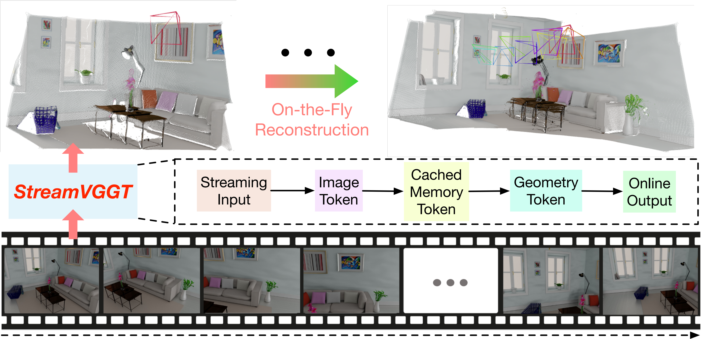

<div align="center">
<h1>StreamVGGT: Streaming 4D Visual Geometry Transformer</h1>
</div>

>StreamVGGT: Streaming 4D Visual Geometry Transformer

>Dong Zhuo<sup>\*</sup>, [Wenzhao Zheng](https://wzzheng.net/)<sup>*</sup>$\dagger$,  Jiahe Guo, Yuqi Wu, [Jie Zhou](https://scholar.google.com/citations?user=6a79aPwAAAAJ&hl=en&authuser=1), [Jiwen Lu](http://ivg.au.tsinghua.edu.cn/Jiwen_Lu/)

<sup>*</sup> Equal contribution. $\dagger$ Project leader.


**StreamVGGT**, a causal transformer architecture for **real-time streaming 4D visual geometry perception** using implicit historical-token memory, delivers both fast inference and high-quality 4D reconstruction.

## News
- **[2025/7/14]** Check out [Point3R](https://github.com/YkiWu/Point3R) for another streaming 3D reconstruction work of ours!
- **[2025/7/14]** StreamVGGT training/evaluation code and VGGT finetuning code release.

## Overview

Given a sequence of images, unlike offline models that require reprocessing the entire sequence and reconstructing the entire scene upon receiving each new image, our StreamVGGT employs temporal
causal attention and leverages cached memory token to support efficient incremental on-the-fly reconstruction, enabling interative and real-time online applitions.




## Acknowledgements
Our code is based on the following brilliant repositories:

- [DUSt3R](https://github.com/naver/dust3r)
- [MonST3R](https://github.com/Junyi42/monst3r.git)
- [Spann3R](https://github.com/HengyiWang/spann3r.git)
- [CUT3R](https://github.com/CUT3R/CUT3R)
- [VGGT](https://github.com/facebookresearch/vggt)

Many thanks to these authors!

<!-- ## Citation -->
<!-- 
If you find this project helpful, please consider citing the following paper:
```

``` -->
